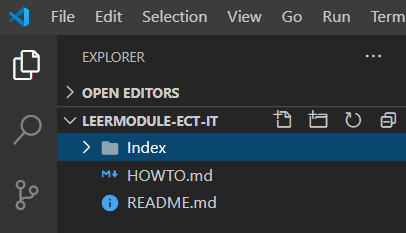

# Inleiding

Ik heb deze github eigenlijk opgestart om studenten te helpen bij het studeren. Nu is de vraag waarom?

Als je aan 2 programmeurs vraagt om een programma te ontwikkelen, en je legt de 2 programma's naast elkaar, dan gaan die nooit hetzelfde zijn. (Tenzij het natuurlijk een heel simpel programma is, maar je begrijpt wat ik bedoel). Daarom zorg ik er voor dat er meerdere oplossingen beschikbaar zijn voor jou. Echter om dit te bereiken heb ik de hulp nodig van medestudenten! Daarom doe ik een oproep aan jou om jouw oplossing te delen met mij zodat wij samen een community kunnen maken die studenten enorm kunnen helpen bij het studeren, want elke student pakt zijn oefening anders aan, en de een is wat creatiever dan de ander. Ik heb hiervoor een soort tutorial gemaakt die jou helpt hoe je nu meehelpt.

# Video tutorial
[Hoe voeg je je eigen wijzigingen toe aan een gezamelijk GitHub repo](https://youtu.be/J053hmKcFag)
# Geschreven tutorial
## Eerste stapjes

In deze uitleg ga ik jou de makkelijkste manier uitleggen.

Voor deze tutorial heb je minstens 2 dingen nodig:

- [Visual studio code](https://code.visualstudio.com/)
- [Git](https://git-scm.com/downloads)
- [Github desktop](https://desktop.github.com/) (optioneel)

Download en installeer deze 3 programma's. (Ik veronderstel dat je de 1ste al gedownload hebt.)

Daarna is het belangrijk om op **GITHUB** een account aan te maken.
> Ik hoop dat je weet hoe je dit moet doen. Lukt dit niet stuur mij dan even een berichtje op Discord.

Nu kunnen we aan het échte werk beginnen.

### Een fork maken
Om ervoor te zorgen dat je wijzigingen op deze repo kan doorvoeren, zal je een **fork** moeten maken. Een **fork** is niets meer dan een persoonlijke kopie van deze repo.

De fork kan je maken door rechtsboven op "Fork" te drukken.

Vervolgens zal je worden omgeleid naar jouw eigen kopie van deze repo.

Verifiëer in de linkerbovenhoek dat er het volgende staat: <*jouw naam*>/**Leermodule-ECT-IT**

### Persoonlijke repo clonen
De volgende stap is jouw persoonlijke repo lokaal openen. Dit kan je doen op verschillende manieren.

#### Git CLI (aanbevolen)
De makkelijkste manier om een repo te clonen is via de Git CLI. Hiervoor is geen extra software buiten Git zelf vereist.

De eerste stap is een map openen waar je deze repo wilt clonen (downloaden). Ik heb hier zelf gekozen voor een map in mijn Documenten.

Nu moet je een terminal-venster in de huidige map openen. Ik gebruik windows, dus ik type gewoon `cmd` in de adresbalk van de bestandsverkenner.

Nadat je op `ENTER` hebt gedrukt, zal er een nieuw terminal-venster zijn geopend, welke al klaar staat in de juiste map.

Nu ga je even terug naar GitHub en druk je op de volgende knop: 

Daarna kopiëer je de URL die verschijnt.

Vervolgens ga je terug naar de terminal & type je `git clone`, gevolgd door de gekopiëerde URL (tip: je kan plakken met rechtsklik). Druk op `ENTER` om te bevestigen.

Om te navigeren naar de juist aangemaakte map, type je `cd Leermodule-ECT-IT`, gevolgd door een `ENTER`.

Om Visual Studio Code in de huidige map te openen, type je `code .`, gevolgd door een `ENTER`.

Je zal zien dat Visual Studio Code meteen in de juiste map wordt geopend.

Hier kan je bestanden aanpassen.

Zodra je tevreden bent met je wijzigingen kan je (TODO)

Een andere manier is GitHub desktop te openen en inloggen met jouw account.

Daarna druk je op deze knop:

Vervolgens druk je op Open met Github Desktop:

Normaal krijg je een venster te zien met "koppeling openen".

Daarna zal Github desktop geopend worden en wordt het project lokaal gekloond.

Als je nu klikt op openen met Visual studio code kan je aanpassing toevoegen en die dan committen.

> Ja mag natuurlijk ook altijd je oplossing naar mij doorsturen als dat gemakkelijker is, maar dit bespaart mij veel werk!

[Terug](/README.md)
